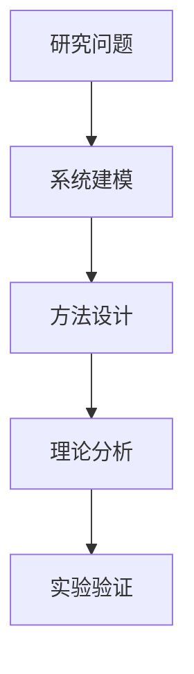

# 完整学习笔记：论文标题

## 0. 来源边界与标签

- 当前可用来源：
- 缺失来源：
- 使用标签：`【论文原文】` `【基础知识】` `【推断解释】` `【批判性分析】` `【未能确认】`

## 1. 快速定位

## 2. 阅读前知识补偿

| 知识点 | 级别 | 为什么需要 | 来源 | 掌握要求 |
|---|---|---|---|---|

## 3. 论文论证结构

### Markdown 层级树

- 研究问题
  - 现有方法限制
  - 本文目标
- 方法
- 理论
- 实验
- 结论

### Mermaid



### ASCII 主线

```text
问题 -> 建模 -> 算法 -> 理论保证 -> 实验 -> 结论
```

## 4. 自适应翻译与逐节精读

### 关键原文

> 【论文原文】短原文。（Sec./p.）

【论文原文】中文翻译。

【推断解释】通俗解释与逻辑作用。

## 5. 原符号—统一符号字典

| 原符号 | 统一概念 | 含义 | 维度/单位 | 代码变量 | 来源 |
|---|---|---|---|---|---|

## 6. 关键公式与算法

$$
J = \int_0^\infty \left(x^TQx + u^TRu\right)\,dt.
$$

- 公式位置：
- 变量与维度：
- 推导逻辑：
- 工程意义：
- 适用条件：
- 代码映射：

## 7. 数学证明

- 证明目标：
- 直观意义：
- 路线图：
- 关键定理/不等式：
- 假设：
- 精确结论：
- 省略步骤与疑点：

## 8. 图表与实验

| 图表 | 作者意图 | 结果 | 是否支持 | 审查问题 |
|---|---|---|---|---|

## 9. 论文—代码映射

| 论文位置 | 文件/函数 | 论文变量 | 代码变量/形状 | 一致性 | 置信度 |
|---|---|---|---|---|---|

## 10. 学术评价

### 作者声称的创新

### 可以确认的创新

### 实验证明的结论

### 尚未充分验证的结论

## 11. 复现路线

## 12. 研究问题漏斗

## 13. 与已读论文的关系

## 14. 理解检查

## 15. 知识画像更新建议

> 待用户确认后更新。

## 16. 对知识库的候选更新

> 默认写入待确认区。

## 17. 继续阅读位置
