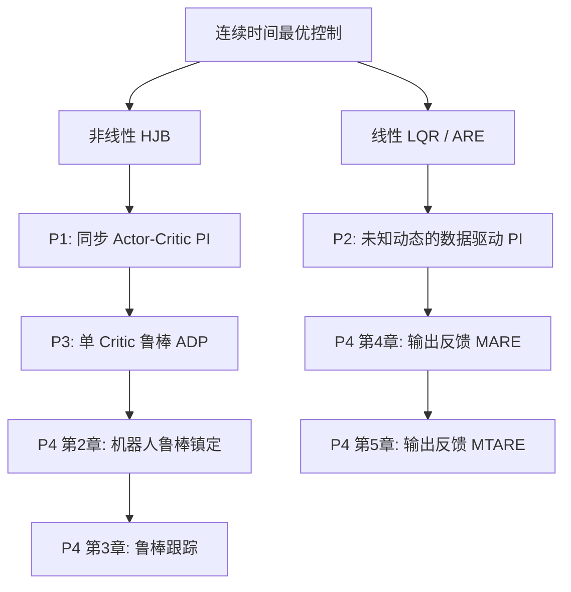

# 四篇文献的方法关系

## Markdown 层级树

- 连续时间最优控制
  - 线性：LQR / ARE / Kleinman Policy Iteration
    - P2：未知 $A,B$ 下用输入—状态数据重构 PI
    - P4 第 4–5 章：输入/输出数据驱动 MARE / MTARE
  - 非线性：Hamiltonian / HJB / 价值函数逼近
    - P1：已知动态，同步 Actor–Critic 在线 PI
    - P3：不匹配不确定性鲁棒控制等价为辅助最优控制，单 Critic
      - P4 第 2 章：机器人鲁棒镇定与 PUMA560/SCARA 验证
      - P4 第 3 章：增广系统鲁棒跟踪

## Mermaid



## ASCII 主线

```text
线性 LQR/ARE --数据化--> P2 ---------> P4 输出反馈 MARE/MTARE
       |                                  ^
       +--提供矩阵与 PI 直觉---------------+

非线性 HJB --> P1 Actor-Critic --> P3 单 Critic 鲁棒 ADP
                                      |
                                      +--> P4 机器人镇定/跟踪/实验
```

## 证据强度

- 【论文原文】P4 参考文献列出 P2（PDF p. 137），发表成果列出 P3（PDF p. 147）。
- 【论文原文】P4 摘要明确说明其第 2 条路线避免 Actor、第 3–4 条路线使用 MARE/MTARE（PDF p. 5–9）。
- 【推断解释】P4 第 2 章与 P3 的问题转化、单 Critic 和参数估计误差路线高度一致，且 P3 是作者博士期间成果，因此可视为“论文方法到机器人章节”的直接扩展；正式逐式对应仍需在精读第 2 章时核查。
- 【未能确认】P2 与 P4 第 4–5 章之间是否存在逐式直接继承尚未完成公式级核对，目前仅确认它们共享数据驱动 Riccati、向量化和秩条件的技术族谱。
