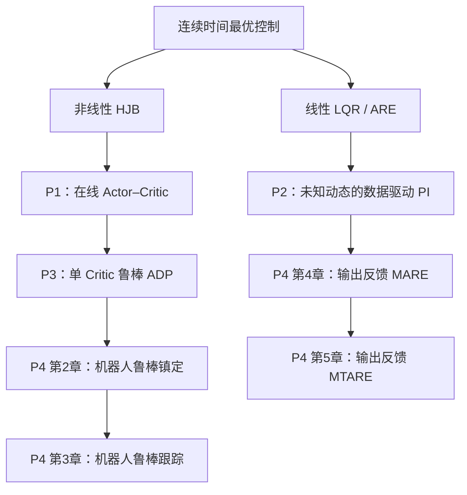

# ADP 预备课程第 1—8 讲总结

> 【基础知识】第 1—7 讲是进入 ADP 论文前的控制理论、最优控制、函数逼近和机械臂控制基础。

> 【论文原文】第 8 讲的论文定位来自四篇文献的摘要、目录、结论和初始化阅读记录；尚未完成全部核心公式的逐式核验。

> 【未能确认】Jiang & Jiang（2012）的现有 PDF 存在版本异常，正式公式级精读前仍需替换或核验可靠原版。

## 一、课程目标

这套课程不是完整替代控制理论教材，而是建立阅读四篇 ADP 论文所需的最小知识链：

```text
状态空间与反馈控制
        ↓
闭环稳定与 Lyapunov 方法
        ↓
LQR、ARE 与 Kleinman PI
        ↓
Bellman 原理与 HJB 方程
        ↓
PI、VI 与 Actor–Critic
        ↓
Bellman 回归、Critic 学习与持续激励
        ↓
机械臂动力学、轨迹跟踪与增广系统
        ↓
复合 Lyapunov、权重误差与 UUB
        ↓
四篇论文的自适应精读路线
```

一句话总结：

> ADP 使用系统数据和函数逼近器近似完成策略评价与策略改进，从而近似求解难以直接处理的 HJB 或 Riccati 方程；应用于机械臂时，还必须同时处理动力学不确定性、轨迹跟踪、数据激励和学习过程中的闭环稳定。

---

## 二、第 1 讲：闭环稳定、Lyapunov、ARE 与 Kleinman PI

### 2.1 状态反馈

连续时间线性系统为：

$$
\dot{x}=Ax+Bu
$$

采用状态反馈：

$$
u=-Kx
$$

得到闭环系统：

$$
\dot{x}=(A-BK)x
$$

如果 $A-BK$ 的全部特征值实部小于零，则闭环系统渐近稳定。

稳定只说明系统能够返回平衡点，不说明返回过程在能量、速度和鲁棒性方面最优。

### 2.2 Lyapunov 方程

选择：

$$
V(x)=x^TPx,\qquad P=P^T>0
$$

沿闭环轨迹求导：

$$
\dot V
=
x^T\left[(A-BK)^TP+P(A-BK)\right]x
$$

若存在 $Q_L=Q_L^T>0$ 使：

$$
(A-BK)^TP+P(A-BK)=-Q_L
$$

则：

$$
\dot V=-x^TQ_Lx<0,\qquad x\neq0
$$

因此，Lyapunov 方程可以用于评价当前闭环策略的稳定性。

### 2.3 固定策略的累计代价

定义：

$$
J_K(x_0)
=
\int_0^\infty
\left(x^TQx+u^TRu\right)dt
$$

固定 $u=-Kx$ 后，如果 $P_K$ 满足：

$$
(A-BK)^TP_K+P_K(A-BK)+Q+K^TRK=0
$$

则：

$$
J_K(x_0)=x_0^TP_Kx_0
$$

所以求解该 Lyapunov 方程就是 Policy Evaluation，即评价当前策略。

### 2.4 ARE 与最优反馈

连续时间 LQR 的代数 Riccati 方程为：

$$
A^TP+PA-PBR^{-1}B^TP+Q=0
$$

对应最优反馈为：

$$
u^*=-K^*x
$$

其中：

$$
K^*=R^{-1}B^TP
$$

### 2.5 Kleinman Policy Iteration

从稳定初始增益 $K_0$ 出发，反复执行：

$$
(A-BK_i)^TP_i+P_i(A-BK_i)+Q+K_i^TRK_i=0
$$

以及：

$$
K_{i+1}=R^{-1}B^TP_i
$$

```text
当前稳定策略 K_i
        ↓ 策略评价
当前价值矩阵 P_i
        ↓ 策略改进
下一策略 K_{i+1}
```

Kleinman PI 是模型驱动的评价—改进原型，也是理解数据驱动 ADP 的重要桥梁。

---

## 三、第 2 讲：Bellman 原理、HJB 与价值函数近似

### 3.1 非线性最优控制问题

考虑：

$$
\dot{x}=f(x)+g(x)u
$$

性能指标为：

$$
J(x_0,u)
=
\int_0^\infty
\left[q(x)+u^TRu\right]dt
$$

最优价值函数为：

$$
V^*(x)=\min_u J(x,u)
$$

### 3.2 Bellman 最优性原理

$$
V^*(x(t))
=
\min_u
\left[
\int_t^{t+\Delta t}r(x,u)d\tau
+V^*(x(t+\Delta t))
\right]
$$

其含义是：

```text
当前最优总代价
= 当前短时间代价
+ 下一状态开始的最优未来代价
```

### 3.3 连续时间 HJB 方程

对 Bellman 方程作连续时间极限，得到：

$$
0
=
\min_u
\left[
q(x)+u^TRu
+\nabla V^{*T}(x)\left(f(x)+g(x)u\right)
\right]
$$

对控制输入求极小值：

$$
u^*(x)
=
-\frac{1}{2}R^{-1}g^T(x)\nabla V^*(x)
$$

这说明最优策略由最优价值函数的梯度决定。

在线性系统和二次价值函数条件下，HJB 方程退化为 ARE。

### 3.4 ADP 为什么要近似价值函数

非线性 HJB 通常无法解析求解，还会受到模型未知和维数灾难影响。因此使用：

$$
\hat V(x)=\hat W_c^T\sigma_c(x)
$$

其中 $\hat W_c$ 是 Critic 权重，$\sigma_c(x)$ 是基函数或神经网络特征。

将近似值代入 HJB，形成 Bellman 误差：

$$
\delta
=
q(x)+\hat u^TR\hat u
+\nabla\hat V^T(x)\left[f(x)+g(x)\hat u(x)\right]
$$

Critic 的学习目标是让 $\delta$ 尽可能接近零。

---

## 四、第 3 讲：PI、VI 与 Actor–Critic

### 4.1 Policy Iteration

固定当前策略 $u_i$ 时，价值函数满足：

$$
q(x)+u_i^TRu_i
+\nabla V_i^T\left[f(x)+g(x)u_i\right]
=0
$$

策略改进为：

$$
u_{i+1}(x)
=
-\frac{1}{2}R^{-1}g^T(x)\nabla V_i(x)
$$

PI 通常收敛较快，但一般需要可容许且稳定的初始策略。

### 4.2 Value Iteration

VI 使用 Bellman backup 更新价值函数：

$$
V_{i+1}(x(t))
=
\min_u
\left[
\int_t^{t+\Delta t}r(x,u)d\tau
+V_i(x(t+\Delta t))
\right]
$$

它不要求每轮都完整求出当前策略的价值函数，而是反复执行价值更新。

### 4.3 Actor–Critic

Critic 近似价值函数：

$$
\hat V(x)=\hat W_c^T\sigma_c(x)
$$

Actor 近似控制策略：

$$
\hat u(x)=\hat W_a^T\sigma_a(x)
$$

- Critic 回答当前状态的未来累计代价有多大。
- Actor 回答当前状态下应该施加什么控制。
- PI 和 VI 是迭代路线，Actor–Critic 是参数化实现结构，二者不属于同一分类维度。

### 4.4 数据和模型分类

- On-policy：行为策略与目标策略相同。
- Off-policy：用一个行为策略的数据评价或改进不同目标策略。
- Model-based：显式使用 $f(x),g(x)$ 或 $A,B$。
- Partially model-free：只消除部分模型依赖。
- Model-free：尽量使用数据，但通常仍需要状态可测、输入方向或系统阶数等先验信息。

---

## 五、第 4 讲：机械臂动力学与轨迹跟踪

### 5.1 机械臂动力学

$$
M(q)\ddot q
+C(q,\dot q)\dot q
+G(q)
+F(\dot q)
+d(t)
=
\tau
$$

| 符号 | 含义 |
|---|---|
| $q,\dot q,\ddot q$ | 关节位置、速度和加速度 |
| $M(q)$ | 对称正定惯性矩阵 |
| $C(q,\dot q)\dot q$ | 科氏力和离心力项 |
| $G(q)$ | 重力项 |
| $F(\dot q)$ | 摩擦项 |
| $d(t)$ | 扰动和未建模动态 |
| $\tau$ | 实际关节力矩 |

重要结构性质包括：

$$
M(q)=M^T(q)>0
$$

以及：

$$
y^T\left[\dot M(q)-2C(q,\dot q)\right]y=0
$$

第二个性质常用于 Lyapunov 导数中的项抵消。

### 5.2 状态空间形式

定义：

$$
x=
\begin{bmatrix}
q\\
\dot q
\end{bmatrix}
$$

机械臂可写成控制仿射形式：

$$
\dot x=f(x)+g(x)\tau
$$

注意：小写 $g(x)$ 是输入矩阵函数，大写 $G(q)$ 是重力项。

### 5.3 跟踪误差

本课程统一采用：

$$
e=q-q_d
$$

定义误差状态：

$$
z=
\begin{bmatrix}
e\\
\dot e
\end{bmatrix}
$$

轨迹跟踪被转换为：

$$
z(t)\rightarrow0
$$

论文也可能定义 $e=q_d-q$，精读时必须先核对符号方向。

### 5.4 滤波误差与计算力矩控制

$$
s=\dot e+\Lambda e,\qquad \Lambda>0
$$

模型准确时可选择计算力矩控制，使误差满足：

$$
\ddot e+K_d\dot e+K_pe=0
$$

真实机械臂存在参数不确定、负载变化和扰动，因此常由基础控制器保证安全，再由 ADP 优化或补偿。

---

## 六、第 5 讲：调节问题如何扩展到时变跟踪

### 6.1 为什么仅使用误差可能不够

对于 $e=x-x_d$：

$$
\dot e
=
f(e+x_d)+g(e+x_d)u-\dot x_d
$$

相同误差可能对应不同的参考速度和加速度，因此需要把参考信息加入价值函数或状态。

### 6.2 增广系统

若参考系统满足：

$$
\dot x_d=h(x_d)
$$

定义：

$$
\zeta=
\begin{bmatrix}
e\\
x_d
\end{bmatrix}
$$

可得到自治增广系统：

$$
\dot\zeta=F(\zeta)+G(\zeta)u
$$

价值函数相应写为 $V^*(\zeta)$。

### 6.3 稳态控制与控制偏差

机械臂完美跟踪时，实际力矩通常不为零：

$$
\tau_d
=
M(q_d)\ddot q_d
+C(q_d,\dot q_d)\dot q_d
+G(q_d)
$$

因此常定义：

$$
\tau=\tau_d+\mu
$$

并优化：

$$
J
=
\int_0^\infty
\left[e^TQe+\mu^TR\mu\right]dt
$$

如果持续运动所需的总力矩不趋于零，却直接对总力矩作无限时间积分，性能指标可能发散。

### 6.4 基础控制器加 ADP

$$
\tau=\tau_b+\mu_{\mathrm{adp}}
$$

- $\tau_b$ 负责基础稳定与安全。
- $\mu_{\mathrm{adp}}$ 负责进一步降低误差、控制代价或补偿未知动态。

阅读论文时必须确认 Actor 输出的是总力矩、虚拟输入、稳态控制偏差，还是未知动力学补偿。

---

## 七、第 6 讲：Critic 权重、Bellman 回归与持续激励

### 7.1 微分 Bellman 回归

固定策略 $u_i(x)$ 后：

$$
r_i(x)
+\nabla V_i^T(x)
\left[f(x)+g(x)u_i(x)\right]
=0
$$

使用：

$$
\hat V_i(x)=\hat W_{c,i}^T\sigma(x)
$$

定义：

$$
\omega_i(x)
=
\nabla\sigma(x)
\left[f(x)+g(x)u_i(x)\right]
$$

Bellman 误差为：

$$
\delta_i
=
r_i+hat W_{c,i}^T\omega_i
$$

可用梯度更新：

$$
\dot{\hat W}_{c,i}
=
-\eta_c\omega_i\delta_i
$$

### 7.2 批量最小二乘

将多个样本堆叠：

$$
\Omega\hat W_c\approx y
$$

若：

$$
\operatorname{rank}(\Omega)=N_c
$$

则可求：

$$
\hat W_c
=
\left(\Omega^T\Omega\right)^{-1}\Omega^Ty
$$

### 7.3 积分 Bellman 方程

$$
V_i(x(t+T))-V_i(x(t))
=
-\int_t^{t+T}r_i(x(\tau))d\tau
$$

代入参数化价值函数：

$$
\left[\sigma(x(t+T))-\sigma(x(t))\right]^T\hat W_{c,i}
\approx
-\int_t^{t+T}r_i(x(\tau))d\tau
$$

积分形式不需要直接数值微分状态，并可能降低部分模型依赖。

### 7.4 持续激励

常见 PE 条件为：存在 $T_0>0$ 和 $\alpha>0$，使：

$$
\int_t^{t+T_0}
\omega(\tau)\omega^T(\tau)d\tau
\geq
\alpha I
$$

它要求数据充分覆盖全部未知参数方向。

稳定控制会使状态快速趋于零，也可能让回归向量失去激励，因此学习和调节之间存在矛盾。

### 7.5 探索信号与历史数据

行为控制可写成：

$$
u_b(t)=u_i(x(t))+e_{\mathrm{ex}}(t)
$$

探索信号提高数据丰富性，但会增加机械臂振动、误差和安全风险。

Concurrent Learning 使用信息丰富的历史样本栈，将持续时间上的 PE 放宽为有限数据秩条件，例如：

$$
\sum_{j=1}^{N}\omega_j\omega_j^T>0
$$

这不是取消信息丰富性要求，而是重复利用一组已经足够丰富的数据。

### 7.6 四种不同收敛

- Bellman 误差收敛不等于权重正确。
- 权重收敛不自动等于策略最优。
- 策略逼近最优不自动等于学习过程始终稳定。
- 闭环状态稳定也不自动意味着权重收敛到真实值。

---

## 八、第 7 讲：复合 Lyapunov、权重误差与 UUB

### 8.1 组合误差

定义：

$$
Z=
\begin{bmatrix}
z\\
\tilde W_c\\
\tilde W_a
\end{bmatrix}
$$

其中：

$$
\tilde W_c=W_c^*-\hat W_c,
\qquad
\tilde W_a=W_a^*-\hat W_a
$$

### 8.2 复合 Lyapunov 函数

$$
V
=
z^TPz
+\frac{1}{2\eta_c}\tilde W_c^T\tilde W_c
+\frac{1}{2\eta_a}\tilde W_a^T\tilde W_a
$$

该函数同时衡量系统误差、Critic 权重误差和 Actor 权重误差。

### 8.3 更新律为何能够保证稳定

在 Lyapunov 导数中，经常出现状态误差和权重误差的交叉项。自适应更新律的重要设计目标之一，就是抵消这些符号不确定的交叉项。

机械臂证明还会利用：

$$
s^T\left[\dot M(q)-2C(q,\dot q)\right]s=0
$$

消除惯性矩阵导数与科氏力相关项。

### 8.4 逼近残差与 Young 不等式

常用：

$$
2a^Tb
\leq
\epsilon\|a\|^2
+\frac{1}{\epsilon}\|b\|^2,
\qquad \epsilon>0
$$

将扰动和函数逼近残差约束为常数上界，最终常得到：

$$
\dot V
\leq
-\alpha\|Z\|^2+\beta
$$

其中 $\alpha>0$，$\beta\geq0$。

当：

$$
\|Z\|>
\sqrt{\frac{\beta}{\alpha}}
$$

有 $\dot V<0$，因此组合误差最终进入有界区域。

### 8.5 UUB 的准确含义

UUB 表示 Uniform Ultimate Boundedness，即一致最终有界：系统经过有限时间后进入某个固定有界区域并保持在其中。

UUB 不等于：

$$
Z(t)\rightarrow0
$$

只有在残差、扰动等附加项能够消失并满足更强条件时，才可能进一步证明渐近收敛。

---

## 九、第 8 讲：四篇论文映射与精读入口

### 9.1 P2：Jiang & Jiang（2012）

【论文原文】摘要强调方法不需要预先知道系统矩阵，研究连续时间线性未知系统的数据驱动最优控制。

主要对应：

- 第 1 讲：LQR、ARE、Lyapunov、Kleinman PI；
- 第 6 讲：积分数据、最小二乘与秩条件；
- 第 7 讲：迭代收敛与稳定性逻辑。

方法主线：

```text
初始稳定增益 K_0
        ↓
采集状态与输入数据
        ↓
构造积分数据恒等式
        ↓
联立估计 P_i 与 K_{i+1}
        ↓
重复使用数据并迭代
        ↓
逼近 LQR 最优解
```

【未能确认】当前供应 PDF 版本异常，正式公式级精读前必须核验 DOI `10.1016/j.automatica.2012.06.096` 对应的可靠 2012 版本。

### 9.2 P1：Vamvoudakis & Lewis（2010）

【论文原文】摘要将方法定位为基于 Policy Iteration 的在线 Actor–Critic 算法，用于连续时间无限时域非线性最优控制。

主要对应：

- 第 2 讲：Bellman、HJB 与价值函数梯度；
- 第 3 讲：PI 和 Actor–Critic；
- 第 6 讲：Bellman 误差与 PE；
- 第 7 讲：复合 Lyapunov 与在线稳定性。

方法主线：

```text
已知非线性系统动态
        ↓
Critic 近似价值函数
        ↓
Actor 近似控制策略
        ↓
同步在线更新
        ↓
PE 与复合 Lyapunov 分析
```

【批判性分析】该论文是非线性 ADP 理论基线，但依赖已知动态，不能直接作为未知机械臂可在线学习的工程证据。

### 9.3 P3：Zhao、Na 与 Gao（2020）

【论文原文】摘要的核心是把含不匹配不确定性的鲁棒控制问题转化为等价最优控制问题。

系统可抽象为：

$$
\dot{x}=f(x)+g(x)u+k(x)d(x)
$$

主要对应：

- 第 2 讲：非线性 HJB；
- 第 6 讲：单 Critic、回归与 PE；
- 第 7 讲：参数估计误差与鲁棒稳定证明。

方法主线：

```text
不匹配不确定性
        ↓
伪逆投影分解
        ↓
构造辅助系统与代价
        ↓
鲁棒问题转化为最优问题
        ↓
单 Critic 近似 HJB
        ↓
稳定与收敛证明
```

【批判性分析】核心价值是鲁棒—最优转化和单 Critic 设计，但只有数值验证，机械臂工程可实现性需要 P4 和后续实验进一步判断。

### 9.4 P4：赵军博士论文（2021）

【论文原文】论文依次研究机器人鲁棒镇定、鲁棒跟踪、输入/输出数据驱动输出反馈控制和输出反馈鲁棒跟踪，并使用 PUMA560 仿真和 SCARA 实验。

主要对应：

- 第 4 讲：机械臂动力学；
- 第 5 讲：轨迹跟踪、增广系统和控制偏差；
- 第 6 讲：数据回归和秩条件；
- 第 7 讲：机械臂结构性质和复合 Lyapunov。

章节路线：

```text
第2章：机器人鲁棒镇定
        ↓
第3章：机器人鲁棒轨迹跟踪
        ↓
第4章：输入/输出数据驱动输出反馈
        ↓
第5章：输出反馈鲁棒轨迹跟踪
```

【论文原文】作者承认输出反馈参数维数较高、复杂参考信号受计算能力限制、速度和力矩难测、数值微分易放大噪声，以及实验平台只有二自由度。

---

## 十、跨论文方法关系图

### 10.1 Markdown 层级树

- 连续时间最优控制
  - 线性 LQR / ARE
    - P2：未知 $A,B$ 下的数据驱动 Policy Iteration
    - P4 第 4—5 章：输入/输出数据驱动 MARE / MTARE
  - 非线性 HJB
    - P1：已知动态的在线 Actor–Critic
    - P3：不匹配不确定性下的单 Critic 鲁棒 ADP
      - P4 第 2 章：机器人鲁棒镇定
      - P4 第 3 章：机器人鲁棒跟踪

### 10.2 Mermaid



### 10.3 ASCII 主线

```text
线性 LQR/ARE ──数据化──> P2 ─────────> P4 输出反馈 MARE/MTARE

非线性 HJB ──> P1 Actor–Critic ──> P3 鲁棒单 Critic
                                          │
                                          └──> P4 机器人镇定/跟踪/实验
```

---

## 十一、统一公式识别表

| 看到的公式或概念 | 应立即识别的作用 | 重点文献 |
|---|---|---|
| $\dot x=Ax+Bu$ | 线性状态空间模型 | P2 |
| Lyapunov 方程 | 固定策略评价与稳定性 | P2、全部证明基础 |
| ARE | LQR 最优价值矩阵 | P2、P4 数据驱动章节 |
| Kleinman PI | 评价—改进迭代 | P2 |
| HJB | 非线性最优控制必要方程 | P1、P3、P4 |
| $\hat V=\hat W_c^T\sigma$ | Critic 价值函数近似 | P1、P3、P4 |
| Actor 网络 | 直接近似策略 | P1 |
| 单 Critic | 由价值梯度直接生成控制 | P3、P4 部分章节 |
| PE 或秩条件 | 保证参数方向可识别 | 四篇均需按章节核查 |
| $M\ddot q+C\dot q+G=\tau$ | 机械臂动力学 | P4 |
| 增广状态 | 将跟踪转化为调节 | P4 第 3、5 章 |
| $g(x)g^+(x)$ | 控制通道投影 | P3 |
| $\dot V\leq-\alpha\|Z\|^2+\beta$ | 通常支持 UUB | P1、P3、P4 的证明 |

---

## 十二、正式精读顺序

推荐顺序保持为：

1. P4 摘要、目录、结论的地图式预览——已完成；
2. P2：线性 LQR、ARE 和数据驱动 PI；
3. P1：非线性 HJB 与 Actor–Critic；
4. P3：不匹配不确定性与鲁棒 ADP；
5. P4：按第 2、3、4、5 章选择性精读。

该顺序优化的是当前学习者的可理解性，不是简单按论文发表年份排列。

P2 的正式入口为：

```text
问题定义
  ↓
LQR 与 ARE
  ↓
Kleinman PI
  ↓
未知 A、B 下的数据恒等式
  ↓
向量化、最小二乘与秩条件
  ↓
Algorithm 1
  ↓
收敛证明和案例
```

---

## 十三、正式精读时的十二项检查

1. 系统是连续时间还是离散时间？
2. 系统是线性还是非线性？
3. 控制任务是调节、跟踪还是鲁棒控制？
4. 哪些动态已知，哪些未知？
5. 当前价值函数和策略分别用什么符号？
6. 采用 PI、VI、Actor–Critic 还是单 Critic？
7. Bellman 误差是微分形式还是积分形式？
8. 数据由 On-policy 还是 Off-policy 行为策略产生？
9. 数据需要 PE、有限激励还是满秩条件？
10. Actor 输出总控制、虚拟控制还是附加补偿？
11. 定理证明稳定、UUB、权重收敛还是最优性？
12. 作者所称 model-free 实际仍使用哪些模型信息？

---

## 十四、当前掌握状态

### 已有明确理解证据

- 能说明 Lyapunov 方程用于评价当前策略；
- 能说明 ARE 用于求 LQR 最优反馈；
- 能说明 Kleinman PI 是经典最优控制与 ADP 评价—改进思想的桥梁；
- 已完成 Bellman、HJB、PI、VI、Actor–Critic、Bellman 回归、机械臂跟踪和 UUB 的课程学习。

### 尚未自动升级的知识等级

按照工作区规则，本课程完成不等同于自动提升正式知识等级。以下能力仍需在论文精读或理解检查中确认：

- 独立推导 P2 的数据恒等式；
- 独立解释 P1 的 Actor/Critic 更新律；
- 独立复述 P3 的鲁棒—最优等价；
- 独立分析 P4 的机械臂跟踪和输出反馈模型；
- 独立判断定理究竟证明渐近稳定还是 UUB。

---

## 十五、课程完成后的继续点

预备课程第 1—8 讲已完成。

下一最高价值动作：

1. 核验或替换 P2 的可靠 2012 PDF；
2. 从 P2 Section 2 开始第一篇公式级精读；
3. 建立原论文符号、统一符号、变量维度和代码形状的四轨对应；
4. 推导未知 $A,B$ 时的数据恒等式；
5. 生成 P2 的完整 Zotero 笔记与复现伪代码。
