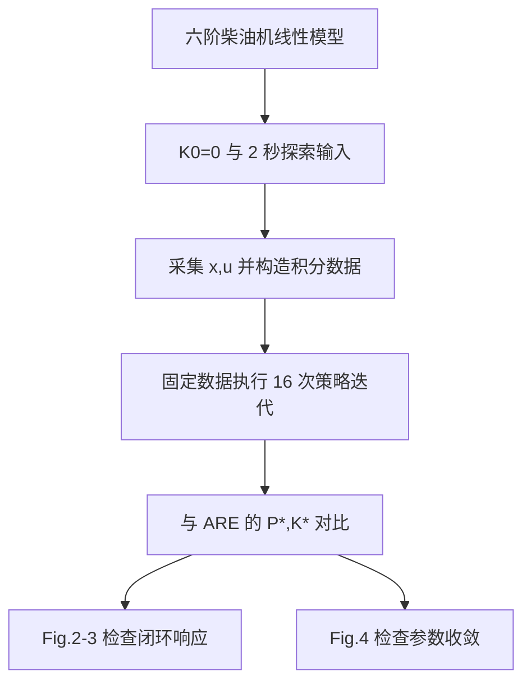

# 完整学习笔记：Jiang & Jiang (2012)

## 0. 来源边界

*   Zotero item：`QP78RTRB`
*   Zotero attachment：`RACDQMBV`
*   正式记录：[ScienceDirect DOI 页面](https://www.sciencedirect.com/science/article/pii/S0005109812003664)
*   【未能确认】本地/Zotero PDF 的可视年份、DOI 年份及部分参考文献被改成 2017-2018，但内嵌元数据、题名和 SHA-256 对应现有附件。公式级阅读必须与出版社 2012 正式页面交叉核对。

## 1. 论文导航地图

| 状态          | Zotero 页码 | 章节/编号                   | 原文起始短语                          | 全文作用              | 跳转                                                    |
| ----------- | --------- | ----------------------- | ------------------------------- | ----------------- | ----------------------------------------------------- |
| ✅ 已讲解，待理解确认 | 1         | Abstract / Sec. 1       | `This paper presents...`        | 问题、贡献与文章结构        | [打开](zotero://open-pdf/library/items/RACDQMBV?page=1) |
| ✅ 已讲解，待理解确认 | 2         | Sec. 2, Eqs. (1)-(5)    | `Consider a continuous-time...` | 建立 LQR 与 ARE 基准问题 | [打开](zotero://open-pdf/library/items/RACDQMBV?page=2) |
| ✅ 已讲解，待理解确认 | 2         | Theorem 1, Eqs. (6)-(7) | `Let K_1 be any stabilizing...` | 把非线性 ARE 改写为策略迭代  | [打开](zotero://open-pdf/library/items/RACDQMBV?page=2) |
| ✅ 已讲解，待理解确认 | 2         | Eq. (8)                 | `For the purpose of solving...` | 旧在线策略评价及其限制       | [打开](zotero://open-pdf/library/items/RACDQMBV?page=2) |
| ✅ 已讲解，待理解确认 | 2-3       | Sec. 3, Eqs. (9)-(13)   | `In this section...`            | 完全未知动力学的数据回归      | [打开](zotero://open-pdf/library/items/RACDQMBV?page=2) |
| ✅ 已讲解，待理解确认 | 3         | Algorithm 1 / Theorem 7 | `Now, we are ready...`          | 实际算法与收敛保证         | [打开](zotero://open-pdf/library/items/RACDQMBV?page=3) |
| ✅ 已讲解，待理解确认 | 4-5       | Sec. 4 / Figs. 2-4      | `In this section...`            | 柴油机数值验证           | [打开](zotero://open-pdf/library/items/RACDQMBV?page=4) |
| ▶ 当前        | 5         | Sec. 5                  | `A novel computational...`      | 结论、贡献边界与未来工作     | [打开](zotero://open-pdf/library/items/RACDQMBV?page=5) |
| ⏭ 暂时略读      | 5-6       | Appendix / References   | `Proof of Lemma 6`              | 秩条件证明与来源谱系        | [打开](zotero://open-pdf/library/items/RACDQMBV?page=5) |


> 锚点预扫描只建立导航，不计入论文已讲解进度。

## 2. 精读单元：系统模型 → 性能指标 → ARE → 最优增益

*   单元 ID：`sec2-eq1-5`

*   状态：`已讲解，待理解确认`

*   位置：Zotero PDF p. 2，Sec. 2，Eqs. (1)-(5)

*   原文起始短语：`Consider a continuous-time linear system described by`

*   Zotero 跳转：[在 Zotero 中打开](zotero://open-pdf/library/items/RACDQMBV?page=2)

*   本单元在全文中的作用：定义后续数据驱动算法必须在不知道  $A,B$  时重新求解的标准 LQR 基准。

### 【论文原文】

> “The design objective is to find a linear optimal control law\...”

### 【中文翻译】

设计目标是寻找一个线性最优控制律，使无限时间性能指标最小。

### 【论文原文】公式链

$$
\dot{x}=Ax+Bu. \tag{1}
$$

$$
u=-Kx. \tag{2}
$$

$$
J=\int_0^\infty\left(x^TQx+u^TRu\right)dt. \tag{3}
$$

$$
A^TP+PA+Q-PBR^{-1}B^TP=0. \tag{4}
$$

$$
K^*=R^{-1}B^TP^*. \tag{5}
$$

### 【学习解释】

*   式 (1) 定义被控对象：状态变化由自然动力学  $Ax$  和控制作用  $Bu$  共同决定。

*   式 (2) 限定策略类别为线性状态反馈。

*   式 (3) 定义“最优”的评价标准：同时惩罚状态偏离和控制能量。

*   式 (4) 是无限时域连续 LQR 的最优性条件；其正定解  $P^*$  表示最优价值函数的二次型矩阵。

*   式 (5) 把价值矩阵转化成最终控制增益。

### 【公式逻辑】

*   来源：式 (1) 的线性系统、式 (2) 的策略形式和式 (3) 的二次型代价。

*   当前作用：建立“已知  $A,B$  时”的模型驱动最优解，供论文后续无模型算法逼近。

*   【作者步骤】：论文直接援引线性最优控制理论得到式 (4)-(5)，未展开 HJB 推导。

*   【补全推导】：令  $V(x)=x^TPx$ ，代入连续时间 HJB：

$$
0=\min_u\left[x^TQx+u^TRu+2x^TP(Ax+Bu)\right].
$$

对 $u$ 求偏导并令其为零：

$$
2Ru+2B^TPx=0
\quad\Rightarrow\quad
u^*=-R^{-1}B^TPx.
$$

将其代回 HJB，得到式 (4)，再由 $u^*=-K^*x$ 得到式 (5)。

*   后续去向：Theorem 1 的式 (6)-(7) 将一次求解非线性 ARE 改成“线性 Lyapunov 策略评价 + 增益更新”。

### 原符号—统一符号与维度

| 论文符号 | 统一概念    | 维度          | 含义              |
| ---- | ------- | ----------- | --------------- |
| $x$  | 状态      | $n\times1$  | 可测系统状态          |
| $u$  | 控制输入    | $m\times1$  | 执行器命令           |
| $A$  | 状态矩阵    | $n\times n$ | 未知自然动力学         |
| $B$  | 输入矩阵    | $n\times m$ | 未知控制通道          |
| $K$  | 策略/反馈增益 | $m\times n$ | 将状态映射为控制        |
| $Q$  | 状态代价    | $n\times n$ | 半正定             |
| $R$  | 控制代价    | $m\times m$ | 正定，因此$R^{-1}$存在 |
| $P$  | 价值矩阵    | $n\times n$ | 对称正定解           |


维度检查：$PBR^{-1}B^TP$ 与 $A^TP$ 均为 $n\times n$；$R^{-1}B^TP$ 为 $m\times n$，与 $K$ 一致。

### 【局部证据截图】


### 【理解检查】

请用自己的话说明式 (1)-(5) 分别承担什么角色，以及为什么式 (4) 仍然不是“无模型”算法。

### 【返回锚点】

*   下一段：Theorem 1 (Kleinman, 1968)
*   位置：Zotero PDF p. 2，Eqs. (6)-(7)
*   Zotero 跳转：[继续阅读](zotero://open-pdf/library/items/RACDQMBV?page=2)

## 3. 精读单元：Kleinman Policy Iteration

*   单元 ID：`sec2-theorem1-eq6-7`
*   状态：`已讲解，待理解确认`
*   位置：Zotero PDF p. 2，Sec. 2，Theorem 1，Eqs. (6)-(7)
*   原文起始短语：`Let K_1 be any stabilizing feedback gain matrix`
*   Zotero 跳转：[在 Zotero 中打开](zotero://open-pdf/library/items/RACDQMBV?page=2)
*   本单元在全文中的作用：把非线性 ARE 的直接求解改写为可迭代的“策略评价 + 策略改进”，为后文的数据驱动改写提供算法骨架。

### 【论文原文】

> “Let $K_1$ be any stabilizing feedback gain matrix...”

### 【中文翻译】

令 $K_1$ 为任意一个能够稳定系统的反馈增益矩阵，并通过 Lyapunov 方程求出当前策略的价值矩阵；随后递归更新策略。

### 【论文原文】式 (6)：策略评价

$$
(A-BK_k)^TP_k+P_k(A-BK_k)+Q+K_k^TRK_k=0.
\tag{6}
$$

### 【论文原文】式 (7)：策略改进

$$
K_k=R^{-1}B^TP_{k-1}.
\tag{7}
$$

论文采用上述索引。将下标整体平移一位后，等价的统一算法形式为：

$$
K_k
\xrightarrow{\text{式 (6)：评价}}
P_k
\xrightarrow{\text{式 (7)：改进}}
K_{k+1}=R^{-1}B^TP_k.
$$

### 【公式逻辑】

*   来源：式 (1)-(5) 的线性系统、二次代价、ARE 与最优增益关系。

*   当前作用：避免直接求解关于 $P$ 非线性的 ARE，改为反复求解关于 $P_k$ 线性的 Lyapunov 方程。

*   【作者步骤】：论文给出式 (6)、式 (7)及稳定性、代价单调性和收敛性结论，没有在正文中重证 Kleinman 定理。

*   【补全推导】：对固定策略 $u=-K_kx$ ，闭环矩阵为

$$
A_k=A-BK_k.
$$

当前策略的瞬时代价变成

$$
x^TQx+u^TRu
=x^T(Q+K_k^TRK_k)x.
$$

令当前策略的价值函数为 $V_k(x)=x^TP_kx$，则

$$
\dot V_k
=x^T(A_k^TP_k+P_kA_k)x.
$$

为了让 $V_k$ 等于从当前时刻到无穷远的累计代价，需要满足

$$
\dot V_k=-x^T(Q+K_k^TRK_k)x,
$$

这正好得到式 (6)。然后利用 $P_k$ 对策略进行贪心改进，得到 $K_{k+1}=R^{-1}B^TP_k$。

*   后续去向：式 (8)尝试不显式使用  $A$  来实现策略评价；Sec. 3 再进一步消除对  $B$  的依赖。

### 【学习解释】

把它对应到软件工程中的迭代过程：

```
当前策略 K_k
    -> 计算它的长期代价模型 P_k       # policy evaluation
    -> 根据 P_k 生成更好的 K_{k+1}    # policy improvement
    -> 重复，直到 P_k 不再明显变化
```

式 (6) 对 $P_k$ 是线性的，因为 $K_k$ 在本轮被视为已知常量；ARE 中则含有 $PBR^{-1}B^TP$，对 $P$ 是二次的。

### Theorem 1 的三条保证

1.  $A-BK_k$  始终是 Hurwitz：每轮学习都保持闭环稳定。

2.  $P^*\preceq P_{k+1}\preceq P_k$ ：代价矩阵按半正定序单调下降，而不是每个矩阵元素逐项下降。

3.  $K_k\to K^*$ 、 $P_k\to P^*$ ：迭代最终收敛到 LQR 最优解。

### 【批判性分析】

Theorem 1 还不是本文最终的无模型算法：式 (6)需要 $A-BK_k$，式 (7)需要 $B$。它只提供正确的策略迭代骨架；后续真正的贡献是用状态与输入数据替代这些未知矩阵。

### 【局部证据截图】


### 【理解检查】

请用自己的话复述：为什么式 (6)叫“策略评价”，式 (7)叫“策略改进”，以及 Theorem 1 保证了哪三件事。

### 【返回锚点】

*   下一段：`For the purpose of solving (6) without the knowledge of A...`
*   位置：Zotero PDF p. 2，Eq. (8)及其后续局限分析
*   Zotero 跳转：[继续阅读](zotero://open-pdf/library/items/RACDQMBV?page=2)

## 4. 精读单元：轨迹积分策略评价及其局限

*   单元 ID：`sec2-eq8-limitations`
*   状态：`已讲解，待理解确认`
*   位置：Zotero PDF p. 2，Sec. 2，Eq. (8)及其后续三段说明
*   原文起始短语：`For the purpose of solving (6) without the knowledge of A`
*   Zotero 跳转：[在 Zotero 中打开](zotero://open-pdf/library/items/RACDQMBV?page=2)
*   本单元在全文中的作用：说明如何通过状态轨迹评价当前策略，同时明确旧方法为什么仍不是真正的完全无模型算法。

### 【论文原文】式 (8)

$$
x^T(t)P_kx(t)-x^T(t+\delta t)P_kx(t+\delta t)
=
\int_t^{t+\delta t}
\left(x^TQx+u_k^TRu_k\right)d\tau,
\tag{8}
$$

其中：

$$
u_k=-K_kx.
$$

### 【中文翻译】

在时间区间 $[t,t+\delta t]$ 上，价值函数的下降量等于当前策略产生的累计状态代价与控制代价。

### 【公式逻辑】

*   来源：Theorem 1 的策略评价 Lyapunov 方程 (6)。

*   当前作用：将含有未知 $A$ 的 Lyapunov 方程变成只含状态轨迹、控制输入和未知 $P_k$ 的积分等式。

*   【作者步骤】：论文给出积分恒等式，并说明在充分激励条件下可以由在线测得的 $x,u_k$ 唯一确定对称矩阵 $P_k$ 。

*   【补全推导】：固定策略 $u_k=-K_kx$ 时，式 (6)给出

$$
\frac{d}{dt}\left(x^TP_kx\right)
=-x^T(Q+K_k^TRK_k)x.
$$

又因为 $u_k^TRu_k=x^TK_k^TRK_kx$，所以

$$
\frac{d}{dt}\left(x^TP_kx\right)
=-\left(x^TQx+u_k^TRu_k\right).
$$

从 $t$ 积分到 $t+\delta t$ 并移项，就得到式 (8)。

*   后续去向：Sec. 3 的式 (9)-(10)保留任意实际输入  $u$  ，把探索信号产生的附加项显式纳入等式，并将  $P_k$  与  $K_{k+1}$  一起求解。

### 【学习解释】

式 (8)可以看成一条监督学习样本：

```
输入特征：x(t)、x(t+δt)及区间内的 x、u_k
未知参数：对称矩阵 P_k
监督目标：区间累计代价
```

因为 $x^TP_kx$ 对 $P_k$ 的独立元素是线性的，多收集若干个不同时间区间，就能组成线性方程组求 $P_k$。对称 $n\times n$ 矩阵只有 $n(n+1)/2$ 个独立未知量，但样本还必须足够丰富、回归矩阵具有足够秩；只有样本数量多并不保证可辨识。

### 论文明确指出的局限

1.  **仍需知道$B$**：式 (8)只替代式 (6)中的  $A$ ；策略改进式 (7)仍为  $K_{k+1}=R^{-1}B^TP_k$ 。

2.  **需要充分激励**：若状态轨迹变化方向不足，就无法唯一恢复  $P_k$ 。

3.  **探索噪声破坏严格等价**：实际输入若为  $u=-K_kx+e$ ，系统轨迹不再由纯闭环  $dot x=(A-BK_k)x$  产生。

4.  **每轮需要重新采集数据**： $K_k$  更新后，纯策略轨迹也发生变化，导致学习速度降低。

### 【补全推导】探索噪声为什么会产生偏差

若实际控制输入为

$$
u=-K_kx+e,
$$

则状态方程变成

$$
\dot x=(A-BK_k)x+Be.
$$

此时价值函数导数多出一项：

$$
\dot V_k
=-x^T(Q+K_k^TRK_k)x
+2e^TB^TP_kx.
$$

式 (8)没有包含 $2e^TB^TP_kx$，所以使用带探索噪声的真实轨迹直接套用式 (8)，得到的 $P_k$ 一般不再与式 (6)的精确解相同。

### 【批判性分析】

式 (8)已经具有数据驱动特征，但只能称为“部分无模型的策略评价”：它没有解决策略改进对 $B$ 的依赖，也没有自然容纳探索输入。因此不能把它与本文 Sec. 3 的完全未知动力学算法混为一谈。

### 【局部证据截图】


### 【理解检查】

请说明：式 (8)消除了哪个未知矩阵？为什么加入探索噪声后不能直接使用原式？为什么还不能称为完全无模型？

### 【返回锚点】

*   下一段：`In this section, we will present our new online learning strategy...`
*   位置：Zotero PDF p. 2，Sec. 3，Eqs. (9)-(10)
*   Zotero 跳转：[继续阅读](zotero://open-pdf/library/items/RACDQMBV?page=2)

## 5. 完整部分精读：Section 3 完全未知动力学的计算型自适应最优控制

*   部分 ID：`sec3-complete-method`

*   状态：`已讲解，待理解确认`

*   位置：Zotero PDF p. 2-3，Sec. 3，Eqs. (9)-(13)，Fig. 1，Algorithm 1，Lemma 6，Theorem 7

*   Zotero 跳转：[从 Sec. 3 开始](zotero://open-pdf/library/items/RACDQMBV?page=2)

*   本部分在全文中的作用：把 Kleinman PI 等价改写为只依赖一次采集的状态—输入数据的线性回归，并继承其收敛性。

### 方法主线

```
初始稳定 K_0 + 探索输入
        -> 一次采集 x,u
        -> 构造 δ_xx, I_xx, I_xu
        -> 每轮用同一数据构造 Θ_k, Ξ_k
        -> 同时求 P_k 和 K_{k+1}
        -> 直到 P_k 收敛
        -> 使用近似最优 K_k
```

<!---->

```
flowchart TD
    A["稳定 K0 与探索信号 e"] --> B["一次采集状态 x 和输入 u"]
    B --> C["构造 delta_xx, I_xx, I_xu"]
    C --> D["给定 Kk 构造 Theta_k 和 Xi_k"]
    D --> E["最小二乘同时求 Pk 与 K{k+1}"]
    E --> F{"Pk 是否收敛"}
    F -- "否" --> D
    F -- "是" --> G["输出近似最优控制"]
```

### 5.1 【论文原文】式 (9)：保留实际输入

$$
\dot{x}=A_kx+B(K_kx+u),
\qquad
A_k=A-BK_k.
\tag{9}
$$

【学习解释】这是对原系统 $\dot x=Ax+Bu$ 的恒等变形：加上再减去 $BK_kx$。关键是保留实际输入 $u$，因此 $u$ 可以包含探索信号，而不必等于当前策略 $-K_kx$。

### 5.2 【论文原文】式 (10)：本文核心数据恒等式

$$
\begin{aligned}
&x^T(t+\delta t)P_kx(t+\delta t)-x^T(t)P_kx(t)\\
&=\int_t^{t+\delta t}
\left[
x^T(A_k^TP_k+P_kA_k)x
+2(u+K_kx)^TB^TP_kx
\right]d\tau\\
&=-\int_t^{t+\delta t}x^TQ_kx\,d\tau
+2\int_t^{t+\delta t}(u+K_kx)^TRK_{k+1}x\,d\tau,
\end{aligned}
\tag{10}
$$

其中：

$$
Q_k=Q+K_k^TRK_k.
$$

#### 【公式逻辑】

*   来源：式 (9)、策略评价式 (6)和策略改进式 (7)。

*   当前作用：把 $A_k^TP_k+P_kA_k$ 替换为 $-Q_k$ ，把 $B^TP_k$ 替换为 $RK_{k+1}$ ，从最终等式中消除未知 $A,B$ 。

*   【作者步骤】：沿式 (9)求 $x^TP_kx$ 的导数，再使用式 (6)-(7)完成代换。

*   【补全推导】：

$$
\begin{aligned}
\frac{d}{dt}(x^TP_kx)
&=x^T(A_k^TP_k+P_kA_k)x\\
&\quad+2(u+K_kx)^TB^TP_kx.
\end{aligned}
$$

利用

$$
A_k^TP_k+P_kA_k=-Q_k,
\qquad
B^TP_k=RK_{k+1},
$$

积分后即得式 (10)。

*   后续去向：式 (10)被向量化为线性回归式 (11)。

#### 为什么它能容纳探索输入？

式 (10)对任意实际输入 $u$ 都保持精确，只要 $P_k,K_{k+1}$满足式 (6)-(7)。因此采集阶段可使用

$$
u=-K_0x+e,
$$

并把 $e$ 的作用保留在可测量的 $u+K_kx$ 中，不再遗漏探索交叉项。


### 5.3 从矩阵未知量变成参数向量

因为 $P_k=P_k^T$，只需要估计其上三角的 $n(n+1)/2$ 个独立元素。论文定义 $\hat P_k$，并把非对角元素乘以 2；对应地定义二次状态特征 $\bar x$，使

$$
x^TP_kx=\bar{x}^T\hat{P}_k.
$$

对每个采样区间 $[t_{j-1},t_j]$，定义：

$$
\delta_{xx,j}=\bar{x}(t_j)-\bar{x}(t_{j-1}),
$$

$$
I_{xx,j}=\int_{t_{j-1}}^{t_j}x\otimes x\,d\tau,
\qquad
I_{xu,j}=\int_{t_{j-1}}^{t_j}x\otimes u\,d\tau.
$$

将 $l$ 个区间的数据逐行堆叠，得到 $\delta_{xx}$、$I_{xx}$ 和 $I_{xu}$。

### 5.4 【论文原文】式 (11)：线性回归

$$
\Theta_k
\begin{bmatrix}
\hat{P}_k\\
\operatorname{vec}(K_{k+1})
\end{bmatrix}
=\Xi_k,
\tag{11}
$$

其中：

$$
\Theta_k=
\left[
\delta_{xx},
-2I_{xx}(I_n\otimes K_k^TR)
-2I_{xu}(I_n\otimes R)
\right],
$$

$$
\Xi_k=-I_{xx}\operatorname{vec}(Q_k).
$$

【学习解释】这一步把控制问题转换成标准线性代数问题：

```
特征矩阵 Θ_k
×
未知参数 [P_k 的独立元素；K_{k+1} 的全部元素]
=
目标向量 Ξ_k
```

未知量总数为：

$$
d=\frac{n(n+1)}{2}+mn.
$$

因此：

$$
\Theta_k\in\mathbb{R}^{l\times d},
\qquad
\begin{bmatrix}
\hat P_k\\
\operatorname{vec}(K_{k+1})
\end{bmatrix}
\in\mathbb{R}^{d}.
$$

### 5.5 【论文原文】式 (12)：最小二乘求解

若 $\Theta_k$ 满列秩，则：

$$
\begin{bmatrix}
\hat{P}_k\\
\operatorname{vec}(K_{k+1})
\end{bmatrix}
=
(\Theta_k^T\Theta_k)^{-1}\Theta_k^T\Xi_k.
\tag{12}
$$

这是普通最小二乘/左伪逆。实现时不应显式计算矩阵逆，宜使用 QR、SVD 或 `lstsq`。


### 5.6 【论文原文】式 (13)：数据秩条件

$$
\operatorname{rank}
\left([I_{xx},I_{xu}]\right)
=
\frac{n(n+1)}{2}+mn.
\tag{13}
$$

【学习解释】右侧就是待估计参数总数。该条件要求采集的数据覆盖所有需要辨识的状态二次项和状态—输入交叉项；样本区间数量至少不小于参数数目，但数量足够仍不等于秩一定足够。

### 5.7 Algorithm 1

1.  选择稳定 $K_0$，在 $[t_0,t_l]$ 使用 $u=-K_0x+e$；采集数据，直到式 (13)成立。
2.  令 $k=0$，由式 (12)同时求 $P_k$ 和 $K_{k+1}$。
3.  令 $k\leftarrow k+1$，继续使用同一批 $\delta_{xx},I_{xx},I_{xu}$ 重建 $\Theta_k,\Xi_k$并求解。
4.  当 $\lVert P_k-P_{k-1}\rVert\le\varepsilon$ 时停止，使用 $u=-K_kx$。

<!---->

```
# 论文算法的结构化伪代码
collect_data(K0, exploration=e)
assert rank(hstack([I_xx, I_xu])) == n * (n + 1) // 2 + m * n

K = K0
P_prev = None
while True:
    Qk = Q + K.T @ R @ K
    Theta, Xi = build_regression(delta_xx, I_xx, I_xu, K, Qk, R)
    theta = least_squares(Theta, Xi)
    P, K_next = unpack(theta)
    if P_prev is not None and norm(P - P_prev) <= epsilon:
        break
    P_prev, K = P, K_next
```

### 5.8 Lemma 6 与 Theorem 7

**Lemma 6**：式 (13)成立时，$\Theta_k$ 对每个 $k$ 都满列秩，因此式 (11)中的 $P_k,K_{k+1}$ 唯一。

**Theorem 7**：从稳定 $K_0$ 开始，式 (12)产生的序列满足

$$
P_k\to P^*,
\qquad
K_k\to K^*.
$$

#### 【作者证明主线】

1.  真实的 Kleinman 对 $(P_k,K_{k+1})$由式 (10)推出必然满足数据方程 (12)。
2.  Lemma 6 保证数据方程的解唯一，所以式 (12)求出的解只能等于真实 Kleinman 对。
3.  因此数据驱动迭代 (12)与模型驱动迭代 (6)-(7)完全等价。
4.  Theorem 1 已证明 Kleinman 迭代收敛，所以式 (12)也收敛到 $P^*,K^*$。

这里的证明不是重新建立一套收敛理论，而是证明“数据方程与已知收敛的 Kleinman PI 等价”。


### 5.9 【批判性分析】Section 3 真正做到与没有做到的事

**做到：**

*   迭代计算不需要使用 $A$ 或 $B$；
*   探索输入可被式 (10)精确容纳；
*   同一批数据可用于全部策略迭代；
*   在秩条件和稳定初始策略下继承 Kleinman 的收敛保证。

**没有做到：**

*   仍假设全部状态 $x$ 可测；
*   仍需事先拥有稳定 $K_0$；
*   仍需人为设计足够丰富的探索信号；
*   理论建立在精确积分和充分秩上，测量噪声、数值条件数与输入约束没有在定理中解决。

所以“completely unknown dynamics”准确含义是“不知道系统矩阵 $A,B$”，不是“没有任何先验条件”。

### 5.10 理解检查

请用自己的话复述四点：输入数据是什么、每轮未知量是什么、为什么数据只需采集一次、Theorem 7 为什么可以直接继承 Kleinman 收敛性。

### 【返回锚点】

*   下一部分：Section 4 柴油机应用、探索信号、停止条件与实验结果
*   位置：Zotero PDF p. 4，原文开头 `In this section, we study the controller design...`
*   Zotero 跳转：[继续阅读](zotero://open-pdf/library/items/RACDQMBV?page=4)

## 6. 完整部分精读：Section 4 柴油机数值验证

*   单元 ID：`sec4-complete-validation`

*   状态：`已讲解，待理解确认`

*   位置：Zotero PDF p. 4-5，Remark 10 / Eq. (14)，Sec. 4 / Eq. (15)，Box I，Figs. 2-4

*   Zotero 跳转：[从 Section 4 开始](zotero://open-pdf/library/items/RACDQMBV?page=4)

*   本部分在全文中的作用：通过一个六阶连续时间柴油机线性模型，数值检查“一次采集数据、多轮策略迭代”能否恢复直接求解 ARE 得到的最优价值矩阵和反馈增益，并展示闭环状态与输出响应。

### 6.1 从方法到验证：Remark 10 与式 (14)

论文先把本方法与离散时间 ADHDP / Q-learning 作类比，定义分块矩阵：

$$
H_k=
\begin{bmatrix}
H_{11,k}&H_{12,k}\\
H_{21,k}&H_{22,k}
\end{bmatrix}
=
\begin{bmatrix}
P_k&P_kB\\
B^TP_k&R
\end{bmatrix}.
\tag{14}
$$

于是策略改进可以写成：

$$
K_{k+1}=H_{22,k}^{-1}H_{21,k}=R^{-1}B^TP_k.
$$

【学习解释】式 (14)没有引入新的控制律，而是把式 (7)重新解释成一个类似 Q 函数二次型的分块矩阵更新。它负责把 Section 3 的连续时间数据回归与 Q-learning 的“从状态—动作价值中提取策略”联系起来；真正的算例从随后的 Section 4 开始。

### 6.2 【论文原文】验证对象与基准

*   对象：带废气再循环（EGR）的涡轮增压柴油机；
*   模型：六阶连续时间线性系统，$x\in\mathbb{R}^6$、$u\in\mathbb{R}^2$；
*   $A,B$：列在 Box I 中，用于生成仿真对象，但控制器学习过程不使用其精确值；
*   基准答案：使用已知 $A,B$ 直接求解 ARE，得到 $P^*,K^*$；
*   初始策略：对象开环已经稳定，因此取 $K_0=0$。

代价权重为：

$$
Q=\operatorname{diag}(1,1,0.1,0.1,0.1,0.1),
\qquad
R=I_2.
$$

【学习解释】$Q$ 对前两个状态的惩罚是其余状态的 10 倍，$R=I_2$ 对两个控制输入采用相同的单位权重。取 $K_0=0$ 使算例绕开了“未知模型下如何先找到稳定控制器”这一困难，因此它验证了学习算法，但没有验证初始化问题。

### 6.3 【论文原文】探索数据与式 (15)

初始状态在原点附近随机选择。在 $t\in[0,2]\,\mathrm{s}$ 内，作者使用多频正弦和作为探索输入：

$$
e(t)=100\sum_{i=1}^{100}\sin(\omega_i t),
\tag{15}
$$

其中每个 $\omega_i$ 从区间 $[-500,500]$ 随机选择。状态和输入信息以 $0.01\,\mathrm{s}$ 为一个积分区间，因此 2 秒采集阶段产生约 200 个区间样本。

【学习解释】100 个不同频率的正弦分量用于激发多个频率方向，使 $I_{xx},I_{xu}$ 更可能满足式 (13)的秩条件。学习数据只在最初 2 秒采集一次，之后不重新运行探索实验。

【未能确认】系统具有两个输入通道，但式 (15)把 $e$ 写成一个标量表达式；正文没有在该处明确说明是将同一信号施加到两个通道，还是分别为两个通道生成同类信号。不能从当前页面擅自确定。


### 6.4 策略迭代与停止条件

*   $t=0$ 到 $2\,\mathrm{s}$：使用探索输入采集数据；
*   $t=2\,\mathrm{s}$：开始利用固定的 $\delta_{xx},I_{xx},I_{xu}$ 进行策略迭代；
*   停止条件：

$$
\lVert P_k-P_{k-1}\rVert\le 0.03;
$$

*   迭代次数：16 次；
*   $t=2\,\mathrm{s}$ 以后：将学习得到的反馈策略作为实际控制输入。

```text
六阶稳定对象 + K0=0
        -> 2 秒多正弦探索
        -> 约 200 个积分区间
        -> 固定数据重复构造 Theta_k, Xi_k
        -> 16 次策略迭代
        -> P_k, K_k 接近 ARE 基准
        -> 检查状态和输出响应
```



### 6.5 Fig. 2：状态范数是否收敛

Fig. 2 绘制六个状态组成的欧氏范数：

$$
\lVert x(t)\rVert_2=\sqrt{x_1^2(t)+\cdots+x_6^2(t)}.
$$

【论文原文】曲线在初始探索阶段出现明显振荡和较大峰值，随后持续下降，并在较长时间尺度上趋近零。

【推断解释】该图支持“学习后闭环状态能够回到平衡点”的数值结论；前 2 秒的剧烈变化与高幅多频探索输入相符。但它只是一条仿真轨迹，没有误差带、重复随机实验或扰动对比。

### 6.6 Fig. 3：两个物理输出的响应

作者选择：

$$
y_1=3.6x_6,
\qquad
y_2=x_4,
$$

其中 $y_1$ 表示空气质量流量（MAF），$y_2$ 表示进气歧管绝对压力（MAP）。

【论文原文】Fig. 3 显示 $t=0$ 到 $10\,\mathrm{s}$ 的输出轨迹，并用箭头标出控制策略更新后的区域。探索阶段内 $y_2$ 波动明显；更新控制策略后，两条输出轨迹变得平滑并朝平衡方向演化。

【批判性分析】在 10 秒窗口末端，尤其 $y_2$ 仍未完全到零，因此不能仅凭 Fig. 3 声称“10 秒内完全收敛”；Fig. 2 的更长 200 秒窗口才展示渐近衰减趋势。


### 6.7 学习结果与 ARE 标准答案

16 次迭代后，论文报告：

$$
K_{15}=
\begin{bmatrix}
-0.7952&-0.0684&-0.0725&0.0242&-0.0488&-0.0002\\
1.6511&0.1098&0.0975&0.0601&0.0212&0.0002
\end{bmatrix},
$$

直接求解 ARE 得到：

$$
K^*=
\begin{bmatrix}
-0.7952&-0.0684&-0.0726&0.0242&-0.0488&-0.0002\\
1.6511&0.1098&0.0975&0.0601&0.0213&0.0002
\end{bmatrix}.
$$

两者在论文给出的四位小数精度下几乎一致。

【推断解释】根据页面中舍入后的矩阵重新计算：

$$
\frac{\lVert K_{15}-K^*\rVert_F}{\lVert K^*\rVert_F}
\approx7.67\times10^{-5},
$$

而价值矩阵的相对 Frobenius 误差约为：

$$
\frac{\lVert P_{15}-P^*\rVert_F}{\lVert P^*\rVert_F}
\approx2.03\times10^{-4}.
$$

这些数值基于论文已经四舍五入的表格，只能作为近似核查，不能视为作者报告的原始高精度误差。

### 6.8 Fig. 4：参数收敛验证

Fig. 4 上图绘制：

$$
\lVert P_k-P^*\rVert,
$$

下图绘制：

$$
\lVert K_k-K^*\rVert.
$$

【论文原文】两条误差曲线在最初几轮迅速下降，随后保持接近零；正文报告算法在第 16 次迭代满足停止条件。

【学习解释】Fig. 4 验证的是“学习参数接近模型已知时的最优参数”，而 Fig. 2-3 验证的是“这些参数用于闭环控制后状态和输出表现合理”。两类证据不能相互替代。


### 6.9 数据复用带来的学习时间优势

【论文原文】作者将本方法与 Vrabie et al. (2009) 的方法比较：若旧方法每轮都需要采集 2 秒数据，那么 16 次迭代需要总计 32 秒学习时间，并且可能需要在每轮重置状态以满足持续激励条件；本文方法只在最初采集 2 秒数据，之后重复使用。

【批判性分析】这是算法结构带来的明确优势，但文章没有提供统一实现、统一计算平台下的运行时间表，因此这里比较的是“所需物理数据采集时间”，不是完整的 CPU 计算耗时。

### 6.10 Section 4 到底验证了什么？

**得到支持的结论：**

*   在确定性的六阶线性仿真对象上，一次探索数据可以支持多轮策略迭代；
*   学习得到的 $P_{15},K_{15}$ 与直接求 ARE 的 $P^*,K^*$ 高度接近；
*   所得控制器使状态范数长期衰减，两个选定输出朝平衡方向演化；
*   相比需要每轮重新采集数据的方法，物理学习数据时间从理论上的 32 秒降为 2 秒。

**尚未得到验证的结论：**

*   这不是实际柴油机硬件实验，只是使用文献模型的数值仿真；
*   没有测量噪声、模型不确定性、外部扰动或执行器饱和实验；
*   只展示一组初始条件轨迹，没有统计重复实验；
*   没有报告回归矩阵 $\Theta_k$ 的条件数或最小奇异值；
*   取 $K_0=0$ 依赖对象开环稳定，没有验证未知不稳定对象的初始化；
*   式 (15)对两个输入通道的具体施加方式没有明确说明。

所以更准确的评价是：Section 4 对算法进行了有说服力的理想数值验证，但还不是噪声环境、约束环境或真实硬件上的工程验证。

### 6.11 理解检查

请用自己的话复述三点：为什么可以取 $K_0=0$、Fig. 4 与 Fig. 2-3 分别验证什么、作者所说的 2 秒对 32 秒优势具体指什么时间。

### 【返回锚点】

*   下一部分：Section 5 Conclusions and future work
*   位置：Zotero PDF p. 5，原文开头 `A novel computational policy iteration approach...`
*   Zotero 跳转：[继续阅读](zotero://open-pdf/library/items/RACDQMBV?page=5)
